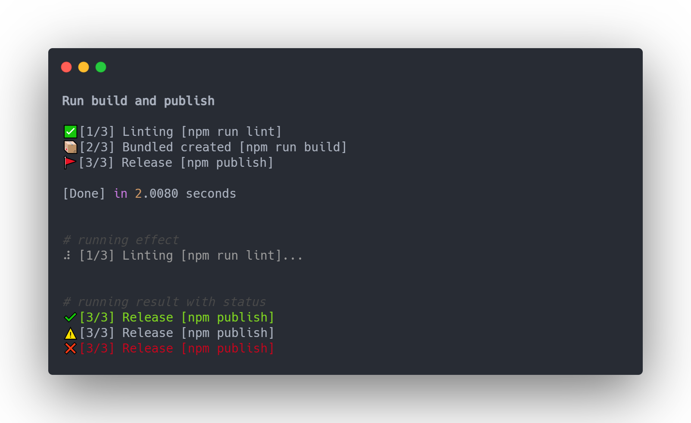

<h1 align="center">Progress Log</h1>

<h4 align="center">让你的node程序日志规范格式化，清晰易理解</h4>

<div align="center">
  
</div>

<p align="center">
  <a target="_blank" rel="noopener noreferrer" href="https://camo.githubusercontent.com/8733716e2fd7444a0f383a9e5f43779a016bae35ddde4e1cc32a4f90bd9bb775/68747470733a2f2f696d672e736869656c64732e696f2f62616467652f76657273696f6e2d312e322e332d626c7565"></a>
  <a href="https://www.npmjs.com/package/progress-logs">
    
  </a>
  <a target="_blank" rel="noopener noreferrer" href="https://camo.githubusercontent.com/a91b4f5528c26920b6b8fa617267a7193a5bddd70a4d013dcf616c91af39fc22/68747470733a2f2f696d672e736869656c64732e696f2f62616467652f636f7665726167652d38302532352d79656c6c6f77677265656e"></a>
  <a href="https://travis-ci.com/klaussinani/progress-logs">
    
  </a>
</p>


### 为什么使用 progress-log

开发node程序时，程序运行日志可能有时会比较混乱、零散，无法有效区分出层次。

`progress-log`可以把你的程序日志变得结构化，清晰化。配合动态加载效果，emoji表情，让你的日志更个性，更富意义。


### 使用方法

使用`progress-log`非常简单，你可以轻易的把它加入现有的代码逻辑中，然后得到你想要的效果。

##### 1. 创建一个日志队列

```js
const ProgressLog = require('progress-log')

const progressLog = new ProgressLog({
    title: 'Build and publish',
    record: true,
    loadingEffect: 18
})
```

创建日志队列，你可以配置：主标题`title`，是否统计时间`record`，运行图标效果`loadingEffect`[默认18, 更多请查看这里](https://github.com/helloIAmPau/node-spinner)。

##### 2. 添加具体日志项

```js
progressLog.add('Linting', 'npm run lint')
progressLog.add('Bundled created', 'npm run build')
progressLog.add('Release', 'npm publish')
```
通过这个列表你也可以很清楚的知道程序运行的整个过程。

添加项时，你可以自定义每个任务项的：成功、警告、失败的图标和颜色

表情图标和颜色参看这里： [图标](../json/all_emoji.json)、[颜色](https://github.com/chalk/chalk#colors)

```js
// 传入字符串，默认指定success状态的值
progressLog.add('Linting', 'npm run lint', { color: 'green', emoji: 'heart'})

// 传入对象可指定成功、失败、警告三种状态的各自的值
progressLog.add('Linting', 'npm run lint', {
    color: { success: 'green', warning: 'yellow', error: 'red' },
    emoji: {success: 'heart', warning: 'heavy_multiplication_x', error: 'warning'}
})
```

##### 3. 在代码逻辑中添加日志动作

```js
progressLog.start()   // 开始执行队列
progressLog.next()    // 运行下一个任务
progressLog.end(0)    // 结束时需传入状态码。 0：成功 1: 失败 2：警告

```


### 个性化配置

##### 可设置全局成功、警告、失败的图标和颜色

```js
progressLog.setGlobalLogEmoji({
    success: 'heart',
    fail: 'heavy_multiplication_x'
})
progressLog.setGlobalLogColor({
    success: 'green'
})
```


### Emoji图标的平台支持

鉴于emoji在各平台和终端中的支持不一致，所以可能导致显示的不一致。

我的主要开发平台是`Windows`, 所以我测试了`Windows`平台下的`Webstorm` 和 `VSCode`，相对来说`VSCode`终端对emoji的支持还是比较好，`Webstorm`自带的终端相对较差，故这里提供一些的可用图标集，自定义时可自己选用。

[所有可用的表情符号集](../json/all_emoji.json)

[Windows下Webstorm可用的表情符号集整理](../json/win32_webstorm_emoji.json)